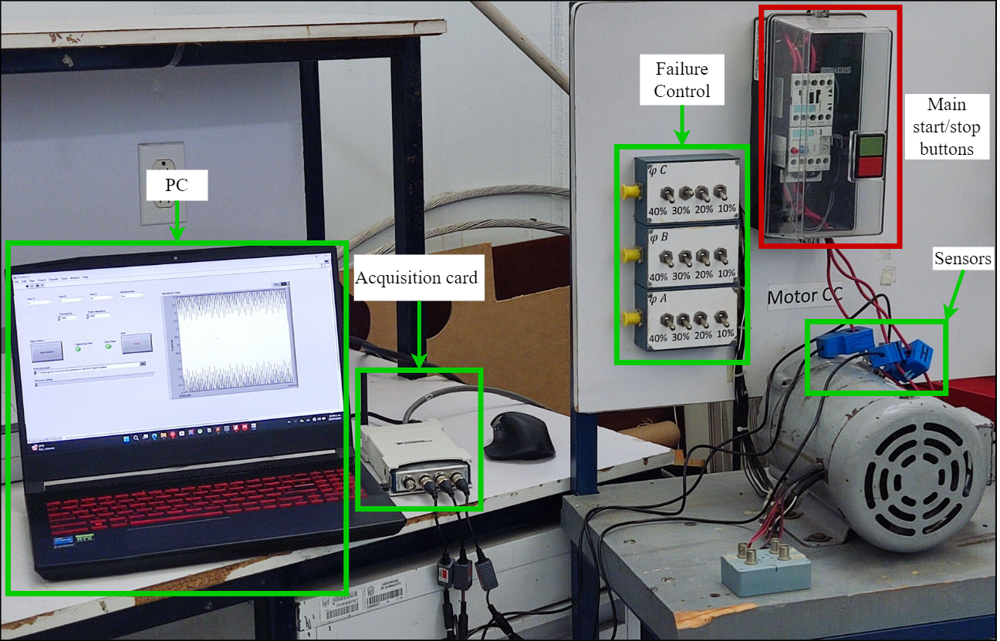
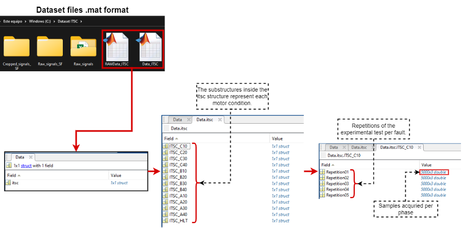
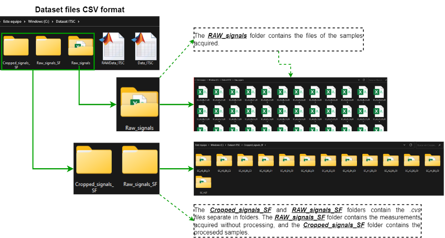

# Experimental dataset for classifying four levels of inter-turn short-circuit per phase in an induction motor.

[](https://github.com/ibarram/ITSC/)
[](README_ES.md)
[](https://opensource.org/licenses/MIT)

<details><summary>Table of Contents</summary><p>
 
 * [Abstract](#abstract)

 * [Testbench](#testbench)

 * [Get the data](#get_the_data)

 * [Database](#database)

 * [Benchmark](#benchmark)

 * [Publications](#publications)

 * [Citing ITSC database](#citing_ITSC)

 * [License](#license)

</p></details><p></p>

## Abstract

The dataset contains the three-phase current signals measured from a squirrel-cage induction motor. The experimental tests were carried out for different fault levels in each winding phase; data was collected for a healthy state. The dataset consists of 13 categories: 12 inter-turn short-circuit faults per phase at 10%, 20%, 30%, and 40%, and healthy. Five repetitions were performed for each experimental condition; moreover, all measurements were collected in a steady state without load.

## Testbench

The dataset was acquired in the Laboratory of Electrical Engineering, Division of Engineering at Irapuato-Salamanca Campus of the University of Guanajuato, Mexico.

The testbench consists of a three-phase general-purpose squirrel-cage induction motor, Baldor CM3542 model, with a power of 0.75 hp, 208-230/460 AC voltage, and 1725 rpm at 60 Hz. The motor has 59 turns per pole with a double-star connection, and it was used to a nominal current of 3A at 230 VAC. 



The faults are selected using a control panel with switches for choosing the phase and severity of the inter-turn short-circuit fault. The dataset consists of 13 categories: 12 inter-turn short-circuit faults per phase at 10%, 20%, 30%, and 40%, and healthy. The electrical current signals of the 3 phases were acquired using a transducer-type split-core current transformer SCT013 model connected to a NI-9215 Series I/O module.

The three phases were sampled simultaneously for 5 seconds, with a sampling rate of 1kHz. Five repetitions were performed for each severity level per phase and the healthy state, giving a total of [5x13=65] measurement files. The acquisitions were made under the steady state without load at 60Hz. The measurements were stored in .csv files of [5000x3] samples per class using LabVIEW. The raw dataset is named T_A”X”_B”X”_C”X”_R0_”Repetition”, where X represents the level of the fault, being 0 healthy conditions, 1-fault at 10%, 2-fault at 20%, 3-fault at 30% and 4-fault at 40%. For example, T_A0_B0_C1_R0_002 corresponds to phase C's second repetition of the inter-turn short-circuit fault at 10%.

The second folder of the dataset contains the files divided into folders according to the corresponding class. The files are named SC_A”X”_B”X”_C”X”_”repetition”; for example, SC_A0_B3_C0_004 corresponds to the fourth repetition of the fault in phase B at 30%.

Finally, a third folder provides the current signals filtered and pre-processed to localize the samples in a steady state to the fault. Therefore, from the [5000x3] samples of the raw data, it was cropped [1000x3] samples. Therefore, the size of this dataset is [classes x repetitions x (n_samples x n_phases)], giving [13 x 5 x (1000x3)] = [65000x3] samples in total.

## Get the data

You can use direct links to download the dataset. The data is stored in the **csv** and **mat** formats.

| Name  | Description | Samples | Size | Link | MD5 Checksum|
| --- | --- |--- | --- |--- |--- |
| `RAW_Signals.zip`  | Raw data in CSV format  | [325,000x3] |4.7 MBytes | [Download](/dataset/RAW_Signals.zip)|`54914b0d0612d8ca7b4f6ab5169f5c0e`|
| `RAW_Signals_SF.zip`  | Raw data in CVS format arranged in folders | [325,000x3] |4.7 MBytes | [Download](/dataset/RAW_Signals_SF.zip)|`9102f70f8e4451c7d2da746a20dcf06a`|
| `Cropped_Signals_SF.zip`  | Cropped and preprocessed data in CSV fotmat  | [65,000x3] |1.7 MBytes | [Download](/dataset/Cropped_Signals_SF.zip)|`3c54a178e39de825c5296d9fd44dcd44`|
| `RAWData_ITSC.mat`  | Raw data in mat format  | [325,000x3]| 7.2 MBytes | [Download](/dataset/RAWData_ITSC.mat)|`514da2bad2f8dc2073f2338a2867b091`|
| `Data_ITSC.mat`  | Cropped and proprocessed data in mat format  | [65,000x3]| 1.5 MBytes | [Download](/dataset/Data_ITSC.mat)|`6040a140a61542e40288106e9245c895`|

Alternatively, you can clone this GitHub repository; the dataset appears under `dataset/`. This repository also contains some scripts for load and visualization.
   
```bash
git clone git@github.com:ibarram/ITSC.git
```

## Database

The database is presented in two formats. The first format uses MATLAB software, providing two .mat files referring to the induction motor's inter-turn short-circuit (ITSC) faults. The organization of the .mat files is illustrated in , where the values and number of samples change depending on which file is selected. The RAWData_ITSC.mat contains all samples collected without processing, contrary to the Data_ITSC.mat, which includes fewer samples due to pre-processing.


Fig. 1.- Schematic representation of the data organized for MATLAB files.

The database was organized into folders for the second format provided, as depicted in Figure 2. Each folder includes the acquired measurements in files. The first folder, “RAW_Signals” contains the files for all the repetitions performed, named SC_AX_BX_CX_R0_00Y.csv. According to the fault phase and severity level, a value between 0 and 4 is included, and the number of repetitions is indicated in “Y” as 1 to 5. For example, for the third repetition of a fault in phase A at 20%, the file is named SC_A2_B0_C0_R0_003.csv. Moreover, the files in this folder contain all measurements acquired without processing.


Fig. 2.- Schematic representation of folders.

The second and third folders, “RAW_Signals_SF” and “Cropped_Signals_SF” contain the .csv files corresponding to the phase, severity, and healthy state, as shown in Figure 2. The files in the subfolders are named SC_AX_BX_CX_00Y.  According to the fault phase and severity level, a value between 0 and 4 is included, and the number of repetitions is indicated in “Y” as 1 to 5. For example, for the second repetition of a fault in phase B at 30%, the file is named SC_A0_B3_002.csv.

In addition to the dataset, scripts to load and read the data are provided for Python, R, C, and MATLAB.

## Benchmark


## Publications


## License

The MIT License (MIT) Copyright © 2017 Zalando SE, https://tech.zalando.com

Permission is hereby granted, free of charge, to any person obtaining a copy of this software and associated documentation files (the “Software”), to deal in the Software without restriction, including without limitation the rights to use, copy, modify, merge, publish, distribute, sublicense, and/or sell copies of the Software, and to permit persons to whom the Software is furnished to do so, subject to the following conditions:

The above copyright notice and this permission notice shall be included in all copies or substantial portions of the Software.

THE SOFTWARE IS PROVIDED “AS IS”, WITHOUT WARRANTY OF ANY KIND, EXPRESS OR IMPLIED, INCLUDING BUT NOT LIMITED TO THE WARRANTIES OF MERCHANTABILITY, FITNESS FOR A PARTICULAR PURPOSE AND NONINFRINGEMENT. IN NO EVENT SHALL THE AUTHORS OR COPYRIGHT HOLDERS BE LIABLE FOR ANY CLAIM, DAMAGES OR OTHER LIABILITY, WHETHER IN AN ACTION OF CONTRACT, TORT OR OTHERWISE, ARISING FROM, OUT OF OR IN CONNECTION WITH THE SOFTWARE OR THE USE OR OTHER DEALINGS IN THE SOFTWARE.
